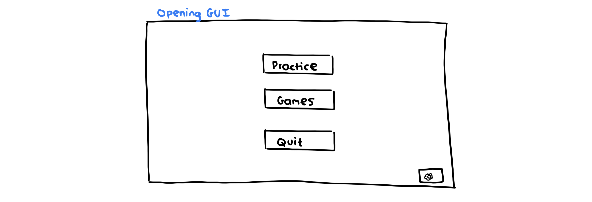
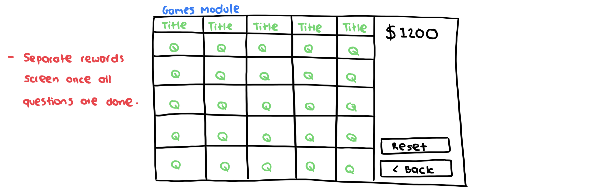
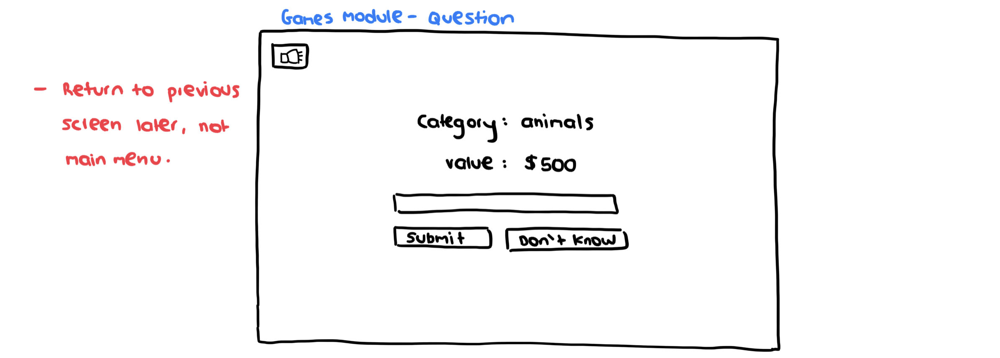
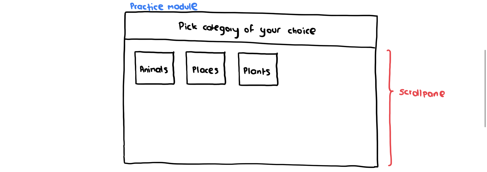
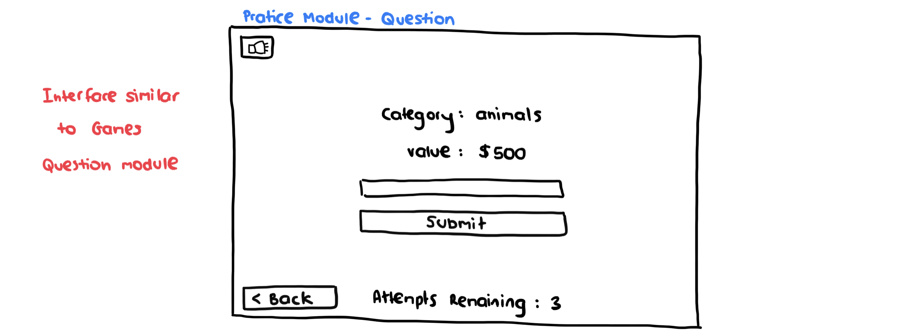

# Initial Wireframing

These images of the wireframes are from the initial meetings that we had. The intention was to create simple layouts that fulfilled all the prerequisites of Quinzical, while having a good User Experience. During development, we had created more models of the screen on [Figma](https://www.figma.com/file/QHQ2MoabbIHJonAWG7fYXe/Quinzical?node-id=0%3A1).

## Main Menu

## Games Module

## Practice Module

